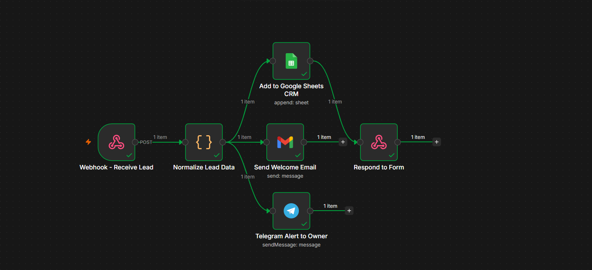
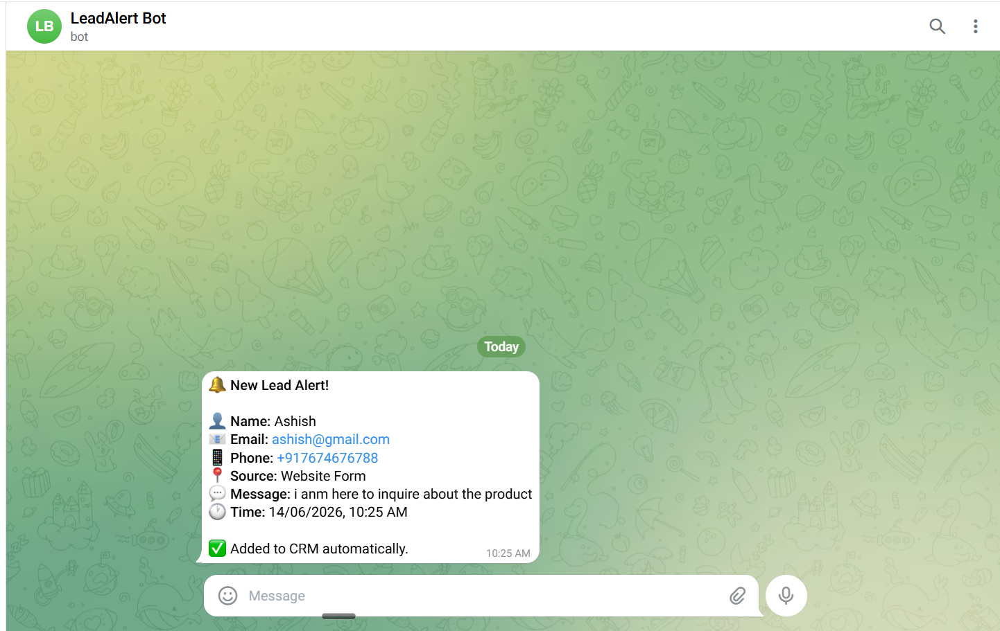
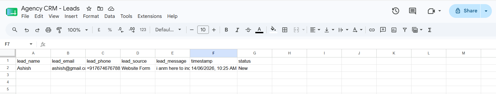

# 🔔 Lead Capture + CRM Auto-Entry Automation


> **Built by [Mahesha Gonal](https://github.com/MaheshaGonal) — Automation Agency Portfolio Project #1**

---

## What This Does

Every time someone submits your lead form, this workflow **automatically**:

- ✅ Captures the lead from any Tally form via webhook
- ✅ Normalises all field data (handles any form structure)
- ✅ Adds a new row to your Google Sheets CRM instantly
- ✅ Sends the lead a personalised welcome email via Gmail
- ✅ Pings you on Telegram with full lead details in under 2 seconds

Zero manual copy-paste. Zero missed leads. Works 24/7.

---

## Workflow Architecture

```
Tally Form Submit
      │
      ▼
[Webhook Trigger]
      │
      ▼
[Normalize Lead Data]  ← JavaScript code node
      │
      ├──────────────────────────────┐──────────────────────────────┐
      ▼                              ▼                              ▼
[Google Sheets]              [Gmail - Welcome]            [Telegram Alert]
Add row to CRM               Email to lead                Ping to owner
      │
      ▼
[Respond to Form]
Return success JSON
```

---

## Live Demo

| Step | Result |
|------|--------|
| Form submitted on Tally | Webhook fires in < 1s |
| Lead row in Google Sheet | Name, Email, Phone, Source, Message, Timestamp, Status |
| Welcome email delivered | Personalised with lead's name and message |
| Telegram notification | Full lead card with all details |


---

## Tech Stack

| Tool | Role | Cost |
|------|------|------|
| [n8n](https://n8n.io) | Workflow automation engine | Free (self-hosted) / Cloud |
| [Tally](https://tally.so) | Lead capture form | Free |
| [Google Sheets](https://sheets.google.com) | CRM database | Free |
| [Gmail](https://gmail.com) | Welcome email sender | Free |
| [Telegram Bot API](https://core.telegram.org/bots) | Instant owner alerts | Free |

**Total infrastructure cost: $0**

---

## Setup Instructions

### Prerequisites
- n8n instance (cloud or self-hosted)
- Google account (Sheets + Gmail)
- Telegram account + Bot token
- Tally account (free)

---

### Step 1 — Import the workflow

1. Download `workflow.json` from this repo
2. Open your n8n instance
3. Click **+** → **Import from file**
4. Select `workflow.json`
5. Click **Import**

---

### Step 2 — Create your Google Sheet

Create a new Google Sheet named `Agency CRM - Leads` with a tab called `Leads`.

Add these exact headers in row 1:

| A | B | C | D | E | F | G |
|---|---|---|---|---|---|---|
| lead_name | lead_email | lead_phone | lead_source | lead_message | timestamp | status |

Copy the Sheet ID from the URL:
```
https://docs.google.com/spreadsheets/d/YOUR_SHEET_ID_HERE/edit
```

---

### Step 3 — Connect credentials in n8n

Open each node and connect:

| Node | Credential needed |
|------|------------------|
| Add to Google Sheets CRM | Google Sheets OAuth2 |
| Send Welcome Email | Gmail OAuth2 |
| Telegram Alert to Owner | Telegram Bot API token |

Paste your Google Sheet ID into the **Spreadsheet ID** field of the Google Sheets node.

---

### Step 4 — Get your Telegram Chat ID

1. Open Telegram → search your bot → send `/start`
2. Visit in browser:
```
https://api.telegram.org/bot<YOUR_BOT_TOKEN>/getUpdates
```
3. Find `"chat": { "id": 123456789 }` — that number is your Chat ID
4. Paste it into the Telegram node

---

### Step 5 — Connect Tally form

1. Go to [tally.so](https://tally.so) → create a new form
2. Add fields: **Name**, **Email**, **Phone Number**, **Message**
3. Go to **Integrations** → **Webhooks**
4. Paste your n8n webhook URL (from the Webhook node)
5. Save and publish your form

---

### Step 6 — Test and activate

1. In n8n, click **Test Workflow**
2. Submit a dummy entry on your Tally form
3. Verify all 5 nodes turn green
4. Check: Google Sheet row added ✓ Welcome email received ✓ Telegram ping arrived ✓
5. Click **Activate** toggle in n8n

**You're live.**

---

## Environment Variables

Create a `.env` file based on `.env.example`:

```env
# Google Sheets
GOOGLE_SHEET_ID=your_spreadsheet_id_here
GOOGLE_SHEET_TAB=Leads

# Telegram
TELEGRAM_BOT_TOKEN=your_bot_token_here
TELEGRAM_CHAT_ID=your_chat_id_here

# n8n Webhook
WEBHOOK_PATH=lead-capture
```

> ⚠️ Never commit your `.env` file. It is listed in `.gitignore`.

---

## Customisation

**Change the form source**
The `Normalize Lead Data` code node accepts any webhook payload. Replace Tally with Typeform, Jotform, or a custom HTML form — no other changes needed.

**Add more CRM columns**
Add columns to your Google Sheet and map them in the Google Sheets node under `columns → value`.

**Change the welcome email template**
Edit the HTML body in the **Send Welcome Email** node. The `lead_name` and `lead_message` variables are already available.

**Add a duplicate check**
Add a **Google Sheets Search** node before the append node to check if the email already exists. Route duplicates to a separate sheet or skip them.

---

## Folder Structure

```
lead-capture-crm-automation/
├── workflow.json          ← Import this into n8n
├── README.md              ← You are here
├── .env.example           ← Credential template
├── screenshots/
│   ├── n8n-canvas.png
│   ├── telegram-alert.png
│   ├── google-sheet.png
│   └── welcome-email.png
└── .gitignore
```

---

## Screenshots

### n8n workflow canvas


### Telegram lead alert


### Google Sheets CRM


### Welcome email delivered


- GitHub: [@MaheshaGonal](https://github.com/MaheshaGonal)
- LinkedIn: [https://www.linkedin.com/in/mahesha-gonal-10836023a/]
- Email: gonalmahesha@gmail.com

---

## License

MIT — free to use, modify, and deploy for personal or commercial projects.

---

*Part of the [Automation Agency Portfolio](https://github.com/MaheshaGonal) — 5 production-ready workflows built to demonstrate real client value.*
